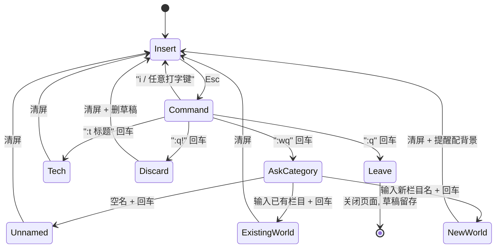

## 0、交接说明（给下一个 AI）

这是一份已经经过多轮打磨的完整 plan，由前一个会话（Claude Opus，planning 模式）产出。下一个模型（当前推测是 Cursor Auto / Composer）接手实施时，请遵守以下原则：

1. **不要重新设计**。plan 里的架构、目录结构、命令集、UI 约定、字符画规范都已经是用户和前一个 AI 反复确认过的结果。不要擅自改"世界模型"、不要改 vim 双模式的语义、不要把 `:wq` 换成别的命令、不要给生活侧加导航、不要给技术侧加花哨样式。
2. **栏目是气味不是分类**——不要在代码注释或 README 里给任何栏目写"这里装 X 内容"的描述（章节一有硬规定）。
3. **字符画背景（`atmospheres/*.txt`）不由代码生成**。用户会自己拿着 `附录 A` 里的 draft prompt 去喂 AI 得到 txt 文件，再粘进 repo。你只负责让 `life.js` 能正确读取 `atmospheres/<栏目名>.txt`。
4. **字符画 prompt 里的三条硬规则要尊重**（章节 3.4）：只写原文明确有的、只写 ASCII 能表达的、不写情绪词。前一个 AI 因为没遵守这三条，第一轮错把 "巨大落地窗" 想成了东京雨夜高层公寓，是血泪教训。
5. **两个栏目的 prompt 目前还缺原文**：`但为君故` 和 `东京红井` 在附录 A 里留空。用户会之后自己补原文让后续 AI 提取锚点。不要擅自给它们编 prompt。
6. **未 GitHub Pages 部署前先本地跑通**。写作页 + 世界传送门在 localStorage 里就能完整闭环，这是章节 4、5 的约定。GitHub API 同步是第 6 步才接入，不要一上来就接。

### 推荐的实施档位

用户倾向于 **档位 A：一次成型 MVP**（详见前一会话讨论）——

- 按章节八的"实施顺序"从 1 到 9 一次写完所有文件
- 每个文件一次 Write 调用，不做二次编辑
- 不跑 dev server、不做 lint 修正的来回、不自测
- 写完即止，小 bug 留给用户手动微调或下一轮对话

预计总产出：4 个 HTML + 4 个 JS + 1 个 CSS + `PROMPTS.md`（从附录 A 剪切出去）+ README + 种子 `scenes/index.json` 和 `tech/index.json`（空壳）。合计约 500~700 行代码。

### 字体和颜色的待定项

章节二提到 style.css 的字体 / 背景 / 字距是"视觉地基"，但 plan 里**没有定下具体字体族和色值**。用户在前一轮聊龙族时表达了倾向：

- 不要赛博朋克 / 不要哥特学院 / 不要纯冷 monospace
- 想要的是"中国老城夕阳 + 夏弥五斗柜"那种**有点旧、有点脏、但有光**的美学
- 中文衬线（霞鹜文楷 / 方正宋刻本 / 或更软的圆体）
- 英文配 EB Garamond 或 Cormorant Garamond
- 色调：**暗金 + 灰蓝 + 红砖 + 落灰**；**不**纯黑白极简
- 正文字号偏小（像夏弥在笔记本上写给自己的字）

实施时请按这个方向选字体和颜色，但**不要为了保险起见就上"系统默认字体"或"纯黑白"**，那就偏离整个站的灵魂了。霞鹜文楷可以直接 CDN 引入（`https://cdn.jsdelivr.net/npm/cn-fontsource-lxgw-wen-kai-screen`），EB Garamond 从 Google Fonts 拿。

### `这里有一个人住过` 角标

章节五之外没有明写，这里补一条：
在 `life.html` 的右下角或底部中央，放一行**极小字号、极低对比度**的灰字：`这里有一个人住过`。不加链接、不加引号、不加署名。访客细看才能看见，是一个"灰尘里的注脚"。字号约正文的 60%，颜色是背景上一个层级的灰。

---

## 一、整体理念

- **不是博客**：没有文章页、没有卡片、没有列表 UI；除了门厅那一层，两侧内部都没有导航。
- **内容即文件**：所有片段 / 文章都是 repo 里的 markdown 文件；所有"氛围"都是 repo 里的 txt 字符画。
- **四层结构**：
  1. 门厅 `index.html` — 黑底居中两个链接，选"生活"或"技术"
  2. 生活侧 `life.html` — 随机世界传送门
  3. 技术侧 `tech.html` — 朴素有序列表
  4. 写作页 `write.html` — 只有你自己用（URL 不公开）
- **生活侧的"世界"模型**：若干个**栏目 = 世界**组成，每个世界有：
  - 一个诗意的名字（龙族式，如"雨落狂流之暗"、"盛夏大逃亡"、"巨大落地窗"、"但为君故"、"东京红井"）
  - 一张 AI 生成的字符画背景（存成纯 txt）
  - 一堆属于它的文字碎片
- **栏目是气味，不是分类**：不要给栏目写"这里装 X 和 Y"的功能说明。写作时凭嗅觉选，今天这段文字是"雨落狂流之暗"还是"但为君故"，你自己闻一下就知道，不需要字典。plan 里**不记录任何栏目的"适用内容"描述**——记录了就会变成分类，就会僵化。
- **"无名之地"是一个普通栏目**，不是主页，不是兜底桶——它只是"不想打标签时默认归属"的那个世界。和其它栏目并列。它的字符画背景也是"未定义"的那种：空、淡、尘埃、风，没有具体物件。
- **生活侧的进入方式 = 随机世界**：访客点"生活" → `life.html` 从所有栏目里抽一个，那个世界的字符画铺满背景，该栏目的几段文字漂浮其上。"原来有这么一个人存在过"——访客是这个人某一刻天气的过客。
- **技术侧是附属**：朴素列表，方便别人看你做过什么。无氛围、无设计。
- **门厅是临时件**：未来拆分生活到独立域名时，两边各自把 `life.html` / `tech.html` 升级为 `index.html`，门厅文件直接删除，不留痕迹。
- **零构建**：GitHub Pages 直接托管，不用 Jekyll / Astro / 任何打包器。

## 二、目录结构

```
/
├── index.html              # 门厅：两个链接「生活」「技术」
├── life.html               # 生活侧入口：随机抽一个栏目浸入
├── write.html              # 全屏写作页（vim 双模式）
├── tech.html               # 技术侧：朴素列表
├── assets/
│   ├── style.css           # 中英文字体、背景、字距（生活侧专用氛围也在里面）
│   ├── gate.css            # 门厅专用（极小，可以合进 style.css）
│   ├── life.js             # 抽栏目 → 铺字符画 + 散文字
│   ├── write.js            # 键盘循环、vim 双模式、:wq 询问栏目、同步
│   └── tech.js             # 读 tech/index.json 有序列出
├── atmospheres/            # 每个栏目的字符画背景
│   ├── 雨落狂流之暗.txt
│   ├── 盛夏大逃亡.txt
│   ├── 巨大落地窗.txt
│   └── 无名之地.txt
├── scenes/                 # 生活片段，按栏目分目录
│   ├── index.json          # {"栏目名": ["文件1.md", "文件2.md", ...]}
│   ├── 雨落狂流之暗/
│   │   └── 2026-04-17T10-22-31.md
│   ├── 盛夏大逃亡/
│   ├── 巨大落地窗/
│   └── 无名之地/
├── tech/                   # 技术专栏
│   ├── index.json
│   └── some-article.md
├── PROMPTS.md              # AI 生成字符画的种子 prompts
└── README.md
```

> 栏目名直接用中文当目录名和 JSON key；GitHub 和浏览器都能正确处理 URL 编码，省掉 slug 维护。

## 三、数据格式（最小化）

### 3.1 生活片段

每个片段 = 一个 markdown 文件，文件名 = ISO 时间戳，**不要 frontmatter**。片段可以一行也可以一整屏，写完就是成品。按栏目存在 `scenes/<栏目名>/` 下。

`scenes/index.json` 是栏目到文件列表的映射：

```json
{
  "雨落狂流之暗": ["2026-04-17T10-22-31.md", "2026-04-18T02-11-09.md"],
  "盛夏大逃亡": ["2026-04-17T15-02-00.md"],
  "巨大落地窗": [],
  "无名之地": ["2026-04-16T23-55-40.md"]
}
```

写作页归档时向对应栏目的数组 push 一条；新栏目则新增一个 key（并自动建目录）。

### 3.2 字符画背景

`atmospheres/<栏目名>.txt` 是纯文本字符画，由你用 AI 离线生成后粘贴。
约定：

- 内容就是字符，无任何 markdown/HTML 标签
- 行数和列宽无强制，前端用 `<pre>` 等宽渲染，再 `transform: scale()` 铺满背景
- 每个栏目**必须有**一张背景 txt；新建栏目时如果还没画好，先放一份空白或占位都行

### 3.3 技术专栏

`tech/index.json` 带标题：

```json
[{ "file": "building-this-site.md", "title": "Building this site" }]
```

### 3.4 字符画 prompts（实施时会生成 `PROMPTS.md`）

每个栏目一段 prompt，由**从龙族原文提取出的视觉锚点**（具体物件 / 材质 / 光 / 构图，不含情绪词）翻译而来。写作流程：

1. 你发来一段原文
2. 我提取该章的视觉锚点（剥掉情绪形容词，只留能被 ASCII 表达的硬元素）
3. 基于锚点写一段 draft prompt
4. 你复制 prompt 喂给任何 AI → 得到字符画 → 粘贴进 `atmospheres/<栏目名>.txt`

这套流程的结果会先汇总在本 plan 的**附录 A**里，实施时再剪到真正的 `PROMPTS.md`。

三条硬规则：

- **只写原文明确有的**，不要加想象；错把夏弥的场景想成"东京雨夜"是血泪教训
- **只写能被 ASCII 呈现的东西**（大轮廓、剪影、纹理、明暗梯度）；冰箱里过期酸奶这种细节写了没用
- **不写情绪词**（不写"孤独""温柔""悲伤"），情绪词会让 AI 自由发挥到赛博朋克去

## 四、写作页 `write.html`（核心体验）

一个全屏 `<textarea>`（或 `<body contenteditable>`），**没有任何可见 UI**：光标、文字、背景，仅此而已。

### 4.1 真・Vim 双模式

为了避免 `:scene` 这类命令和"想写字面量 `:scene`"冲突，采用 vim 风格的双模式：

- **Insert 模式（默认）**：随便打字，`:anything` 都只是文本。所有输入实时写入 `localStorage.draft`。
- **Command 模式**：按 `Esc` 进入。唯一的视觉变化是光标颜色/形状（例如从 I-beam 变成方块），不加任何 UI 组件。
  - 在 command 模式下按 `:` 弹出命令行（页面最底部一行，只有在命令模式下可见），输入命令回车执行。
  - 按 `i` 或任何非命令键 → 回到 insert 模式。

### 4.2 命令集

- `:wq` 回车 → **归档并清屏**（生活博客核心流程）
  1. 命令行变为 `栏目：` 提示（同时在命令行上方极小字号列出已有栏目名，可用 Tab 补全）
  2. 用户直接回车（空名）→ 归入「无名之地」：写入 `scenes/无名之地/<ISO 时间戳>.md`
  3. 用户输入已有栏目名 + 回车 → 写入 `scenes/<栏目>/<ISO 时间戳>.md`
  4. 用户输入**新栏目名** + 回车 → 创建 `scenes/<新栏目>/` 目录并写入第一条；提示"记得给它配一张字符画背景"（但不强制，前端缺省用黑底）
  5. 若配置了 PAT，自动通过 GitHub Contents API commit 新 md + 更新 `scenes/index.json`；否则入 `localStorage.archived` 等下次 `:push`
  6. 缓冲清空，回到 insert 模式
- `:t <title>` 回车 → **技术专栏归档**（明确分叉到附属模块）
  - 写入 `tech/<YYYY-MM-DD-slug>.md`，`tech/index.json` 追加 `{file, title}`
- `:q` → 离开页面，`localStorage.draft` 保留，下次回来继续写
- `:q!` → 清空缓冲 + 删除 `localStorage.draft`（真正"不保存地退出"）
- `:push` → 把所有仅本地的已归档片段一次性推到远程
- `:token` → 用原生 `prompt()` 设置/更新 GitHub PAT（存 localStorage，不进 repo）

> 记忆法：`:wq` = 写入并退出这一段（生活）；`:t` = 丢给技术专栏。空名 = 无名之地。

### 4.3 交互流程图



### 4.4 其他约定

- 字体 / 背景 / 行距全部在 `assets/style.css` 里写死，是写作体验的一部分。
- 命令行（`:` 触发出现的那一行）用纯文本渲染，不是 modal、不是 popup，就是底部一行字。
- PAT 仅存在你自己的浏览器 localStorage，不进 repo，安全足够。

## 五、门厅 `index.html` 和 生活侧 `life.html`

### 5.1 门厅（gate）

整个站点最简单的一块。用来做"你想看哪一面？"的选择：

```html
<!-- 大意如此，实际细节由 style.css 控制 -->
<body class="gate">
  <a href="life.html">生活</a>
  <a href="tech.html">技术</a>
</body>
```

视觉约定：

- `body.gate` 纯黑背景，整页居中对齐
- 两个链接上下排列，间隔比较松，无下划线，hover 时才出现
- 字体和生活侧一致（中文衬线 / 手写感），让人一看就知道这是"某个人的站"而不是工程师仪表盘
- 不要 logo、不要副标题、不要"About me"、不要日期

> 这层是临时结构。拆分域名那天，生活域名的 `index.html` 直接覆盖为 `life.html` 的内容；技术 repo 的 `index.html` 直接覆盖为 `tech.html` 的内容。这个 gate 文件被删除。

### 5.2 生活侧 `life.html`（世界传送门）

`life.js` 做四件事：

1. `fetch('scenes/index.json')` 拿到所有栏目
2. **随机抽一个栏目**（权重均匀，包含"无名之地"）
3. `fetch('atmospheres/<栏目名>.txt')` → 放进一个 `<pre id="atmos">` 铺满视口，低透明度、等宽、`z-index: -1`
4. 从该栏目的片段列表里随机挑 N 条（3~6），各自 `fetch` markdown，放进 `<div>`，用随机 `top / left / transform: rotate() / opacity` 撒到字符画之上

CSS 关键点：

- `body` 纯黑或纯墨色背景（和字符画背景色一致）
- `#atmos` 定位 `fixed`，`inset: 0`，`white-space: pre`，字体 `monospace`，颜色比正文低一档对比度
- 片段 `<div>` 无边框、无卡片背景、`position: absolute`，字体用 `style.css` 里定义的诗意中英文字体

**生活侧内部无任何导航**——访客不能主动"切换世界"，只能刷新重掷。这是刻意的。想看另一面的你？那就再来一次。唯一例外：左下角或右下角可以有一个极小的"回门厅"链接（一个字符即可，例如 `·` 或 `回`），方便访客退回去看技术侧。

## 六、技术侧 `tech.html`（附属）

`tech.js` 读 `tech/index.json`，按数组顺序渲染成一列标题链接。点击后 `fetch` 对应 markdown，用 [marked](https://github.com/markedjs/marked) CDN 版本渲染到同页面。

- **无氛围、无设计**：白底黑字 + 系统等宽字体就好，不要花哨
- **不和生活侧共享任何视觉语言**：访客一看就知道"这块是正经内容，方便阅读"
- 页面顶部/底部可以有一个小字"回门厅"链接（指回 `index.html`），同样极简
- 拆分后，这个页面直接升级为技术 repo 的 `index.html`，改一行 title、去掉"回门厅"链接即可

## 七、部署 & 未来拆分

现在：单 repo，开 GitHub Pages，`main` 分支根目录。访问 `https://<user>.github.io/<repo>/` 打开门厅，`/life.html` 和 `/tech.html` 是两侧入口。

未来拆分生活 / 技术（你拿到域名那天）：

- **生活侧**（搬走）：新 repo + 新域名
  - 拷贝 `life.html` / `write.html` / `assets/life.js` / `assets/write.js` / `assets/style.css` / `atmospheres/` / `scenes/`
  - 把 `life.html` 重命名为 `index.html`
  - 去掉"回门厅"那个小链接
- **技术侧**（留在原 repo）：
  - 删掉 `life.html` / `write.html` / `atmospheres/` / `scenes/` / `assets/life.js` / `assets/write.js`
  - 把 `tech.html` 重命名为 `index.html`
  - 删掉原来的门厅 `index.html`（已经被覆盖）
- 两边都是**静态文件 + 独立 index.json + 独立 JS**，迁移就是剪切粘贴。

这个"天生可拆分"的结构就是架构上最值钱的东西——门厅是现在为了访客方便而加的临时件，拆分那一刻自然消失。

## 八、实施顺序（建议）

按"从最核心的体验开始，每一步都能独立跑起来"的顺序：

1. **骨架**：repo 初始化，四个 HTML 空骨架（index/life/write/tech），`assets/` 目录，开启 GitHub Pages。
2. **视觉地基**：`style.css` 定下字体 / 背景 / 字距，是整个站点氛围的根基。
3. **写作闭环（离线版）**：`write.html` + `write.js`，vim 双模式 + `:wq` 询问栏目 + 全部写进 `localStorage`。此时无远程同步，但你已经可以用它每天写东西。
4. **氛围资产**：先手工放 2~3 份 `atmospheres/*.txt`（配 2~3 个种子栏目），`PROMPTS.md` 同时写好。
5. **世界传送门**：`life.html` + `life.js`，从 localStorage（开发期）或 scenes 目录（联网期）读片段，铺字符画 + 散文字。
6. **远程同步**：`write.js` 接 GitHub Contents API，`:token` / `:push`，把已归档片段推到 repo + 维护 `scenes/index.json`。
7. **技术侧**：`tech.html` + `tech.js`，marked CDN 渲染。
8. **门厅**：`index.html`，最后做，最简单——黑底两个链接而已。
9. **README**：使用流程、PAT 最小权限（`contents:write`）、新建栏目的完整操作（建目录 + 字符画 + 首次归档）、未来拆分域名步骤。

---

## 附录 A：字符画 prompts（working，按栏目汇总）

每个栏目一节：**原文来源** → **视觉锚点**（从原文剥离情绪后的硬元素）→ **draft prompt**（可直接粘给任意 AI，生成完存到 `atmospheres/<栏目名>.txt`）。

当前状态：

- [x] 巨大落地窗
- [x] 盛夏大逃亡
- [x] 雨落狂流之暗
- [ ] 但为君故（待原文）
- [ ] 东京红井（待原文）
- [ ] 无名之地（无原文——约定为空/淡/尘埃/风，最后单独写）

---

### A.1 巨大落地窗

**原文来源**：楚子航去夏弥 31 号楼 201 室收拾遗物（日暮打开门的那一刻开始）。

**视觉锚点**：

- 主体构图：一整面**落地窗格**占画面中央偏右；窗外**红色夕阳正在坠落**
- 地面上**窗格的阴影向画面前方拉长**（原文："黑色的牢笼似的"）——**核心视觉**
- 金属窗框**锈蚀**，**几格玻璃破碎**，**晚风灌进屋子**
- 室内（能转成剪影的）：**房间正中一张床**、角落**五斗柜**、另一角**老式双开门冰箱 + 灶台**
- 枕头上一个很小的**轻松熊轮廓**——像一颗标点一样的点缀
- 窗帘一边是**蕾丝纱**（稀疏网格），一边是**深青色绒帘**（密实字符块）
- 窗外建筑：**低矮红砖楼**的剪影；偶有**梧桐枯枝**横过画面上缘
- 光：**夕阳斜光带**穿过窗，打到地板和墙上
- 时间：日暮将尽
- 色调心锚（prompt 用文字说）：**锈灰 + 暗红砖 + 深青 + 夕阳金**

**draft prompt**：

```
生成一张 80 列 × 40 行的纯 ASCII 字符画，主题是：

一个废弃老居民楼里的单间，房间正中央有一张孤零零的床；画面中央偏右是一整面巨大的
落地窗，金属窗框锈蚀，有几格玻璃破碎；窗外一轮红色夕阳正在下坠，窗格的长长阴影
向画面前方投下来，在地板上形成一个黑色的网格牢笼；屋角一侧有一个老式五斗柜，
另一侧有一个老式双开门冰箱和一个小灶台；枕头上有一个很小的小熊轮廓。

只使用标准 ASCII 字符（字母、数字、标点、斜线、竖线、井号、问号、星号）。
不要任何颜色标签或说明。不要 emoji。不要解释。
留白要大，让夕阳穿透窗的斜光带有呼吸感。直接输出整张图。
```

---

### A.2 盛夏大逃亡

**原文来源**：路明非带绘梨衣从东京开车到四国梅津寺町看最后一次落日（登山电车 → 矿井遗址 → 悬崖边日轮触海）。

**视觉锚点**：

- 主体构图：**悬崖边凸出的一块岩石**上，两个人**并肩剪影**（女孩裙摆被风吹起，抱着**巨大的轻松熊**）
- 前方：**半轮红日触及海面**，海面**倒影的半圆补完整个圆**——原文直接点名这个图形
- 远景三层：
  - **数万公顷的树海**，像起伏的波涛（重复 `^` `~` `w` 等字符铺陈）
  - **曲折的海岸线**蜿蜒进画面远处
  - 远远一座**小小的摩天轮**（中空圆 + 辐条），投下比自己大得多的影子
- 中景：**锈迹斑斑的矿车轨道** + 轨道旁一座**木制庙宇式建筑**，椽下挂满**鲤鱼旗**（一串小三角）
- 一侧远处：**黄色慢速列车**停在一个小站旁，白色栏杆围着，站牌立在那儿
- 画面边缘偶尔一两片**樱花 / 落叶**飞过（`*` `.` `'` 点缀）
- 光：**夕阳烧云**——画面上方有一条浓密的横向渐变字符带
- 时间：太阳即将完全落下的那一两分钟
- 色调心锚：**苍红 → 红黑 → 暗金**，半轮太阳 + 倒影 = 一个圆
- 可选加料：画面右上或左上**一个小小的瞄准镜十字**（很淡），暗指酒德麻衣视角——不加也行

**draft prompt**：

```
生成一张 80 列 × 40 行的纯 ASCII 字符画，主题是：

一座海边悬崖上凸出的岩石，两个人并肩站在岩石上成为剪影（女孩子的裙摆被风吹起，
怀里抱着一个大熊玩偶）。他们正面对的是：一轮红色的太阳下坠到海面，海面上的
倒影与之拼成一个完整的圆；脚下是数万公顷起伏的树海，像波浪一样铺向远方；
远处有曲折的海岸线，一座小小的摩天轮在画面远端旋转，投下比自己大得多的影子；
再远处临海的轨道上有一列小小的黄色列车停在一个小站旁。中景里隐约可见锈迹斑斑
的矿车轨道和一座木头屋檐下挂满小三角旗的建筑。画面上方的云被夕阳烧成浓密的
横向条带。偶尔有一两片樱花或落叶飘过。

只使用标准 ASCII 字符。不要颜色标签、emoji、解释。留白自由。
画面要宽阔、层次分明——前景人物剪影 / 中景轨道与屋檐 / 远景海与树海与摩天轮 /
顶部烧云。直接输出。
```

---

### A.3 雨落狂流之暗

**原文来源**：楚子航的生父在台风"蒲公英"登陆当天开 Maybach 62 来接他放学，车被死侍围攻在封路的城市高架路上；奥丁骑 Sleipnir 持 Gungnir 现身堵住出口；父亲以 御神刀·村雨 挥刀抵挡，诱走所有敌人，让 楚子航 一人驾车逃出。

**视觉锚点**（分层构图，从下往上）：

- **整体视角约定**：像是**隔着一层被暴雨冲刷的挡风玻璃**看出去——所有物体都被**竖向的雨线**贯穿并切碎。这是这张图与前两张图最大的区别：`巨大落地窗` 是室内静物、`盛夏大逃亡` 是宽阔远景，这张图是**被雨切割的战场**。
- **第一层（最底 / 最近）**：一辆巨大**黑色豪华轿车的正面车头**（双 M 菱形车标 + 水平宽大前格栅 + 两道**氙灯射出的白色光束**向画面前方扩散）
- **第二层（车前方，在车灯光束里）**：一个男人的**背影**，右手握着一柄**细长的日本长刀**，黑色鞘已脱离，刀身竖直笔立；这是画面里唯一能看清人形轮廓的人
- **第三层（中景）**：两侧**一整面垂直的水幕 / 雨壁**把画面封成一个通道（用密集堆叠的 `|` `/` 字符）
- **第四层（中上景）**：水幕中间走出来——**一匹巨大的八条腿神马**（身躯小山一样，披戴沉重甲胄），马背上一位**铁面的巨大骑士**，**独眼金光**，手中持一柄**弧线如流星的长枪**，枪尖斜斜指向地面
- **中段四散**：几十个**人形黑影剪影**，高度只到车头灯的一半，四肢稍长，没有面部；每个影子的位置只用**一两个小小的金色点**代表瞳孔
- **画面顶部**：**一道 Z 形闪电**从压得极低的铅色云层里劈下来；云层低到像要压到高架路面上
- **两侧路缘**：**两条平行的高架路护栏剪影**从画面下方向远处收束，消失在水幕里
- **地面**：水面漂着**拉长的血带**（比背景更深的零散点 `.` `,` `'` 分布，在车灯光柱照到的地方更密）
- **光源优先级**：整张画面**只有两处亮光**——车前大灯的**白光柱** + 奥丁的**金色独眼**；其它全是黑 / 灰 / 雨
- **色调心锚**：水银白 + 暗金 + 铅灰 + 漆黑，没有任何暖色
- **时间**：台风夜，黑得像深夜

**draft prompt**：

```
生成一张 80 列 × 40 行的纯 ASCII 字符画，主题是：

一场台风夜的城市高架路上。画面最下方是一辆巨大的黑色豪华轿车的正面车头，
双菱形车标在格栅上方，两道白色氙灯光束向画面前方扩散。车前方站着一个男人
的背影，右手握着一柄细长的日本长刀，站在车灯的光束里。车左右两侧是一整面
垂直的雨水墙，把画面封成一条通道。从雨水墙的中间走出一匹巨大的八条腿的
神马，马背上坐着一个铁面的巨大骑士，骑士只有一只眼睛发着金色的光，手里
握着一柄弧线像流星的长枪，枪尖斜斜指向地面。画面中段散布着几十个矮一点
的黑色人形剪影，每个剪影只有一两个小小的金色光点代表眼睛。画面顶部一道
Z 形闪电从压得极低的铅色云层里劈下。两侧高架路的护栏向画面远处收束。
地面水面上漂着拉长的血带。

整张画面被密集的竖向雨线从上到下贯穿，像是透过一层被雨水冲刷的挡风玻璃
往外看，所有物体都被竖向雨线切碎。

只使用标准 ASCII 字符（字母、数字、标点、斜线、竖线、井号）。整张图里
只有两处是亮的——车前大灯的白光柱和骑士的金色独眼，其余一切都是黑与灰。
不要颜色标签、emoji、解释、边框。层次分明：车头 → 站刀男人 → 水幕 →
神马骑士 → 低压云 + 闪电。直接输出整张图。
```

### A.4 但为君故 *(待原文)*

### A.5 东京红井 *(待原文)*

### A.6 无名之地

**定位**：不对应任何具体章节。这是"还没被命名的世界"，所以它的图也该是**一张没被定义的图**。

**视觉锚点**（约定性的，不来自原文）：

- 大面积留白
- 极稀疏的**尘埃感**字符（单个 `.` `,` `'` 散落，密度极低）
- 一条若有若无的**风的痕迹**（几个字符斜向排成一行，很淡）
- 没有任何可辨识的物件

**draft prompt**：

```
生成一张 80 列 × 40 行的纯 ASCII 字符画，主题是"一片几乎空白的画面，像清晨还没
有任何东西降落在上面的那种空。只有极少数非常稀疏散落的小点（`.` `,` `'`），
以及一条若有若无的斜向字符（像风吹过留下的一道痕迹）。画面绝大部分是空白。
不要任何具体物件、建筑、人物、植物。不要对称。不要标点堆叠。
只使用标准 ASCII，不要 emoji、不要颜色、不要解释。直接输出整张图。
```
